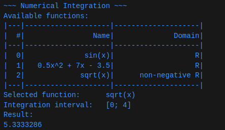

# go-integration: numerical integration in Go

This is a program that calculates single definite integrals using [trapezoidal integration](https://en.wikipedia.org/wiki/Trapezoidal_rule).
I made it for the purpose of practicing my programming skills.

Feel free to study this program (AGPL license) and post suggestions; I hope we can learn together.

\+ Bartosz Gleń
